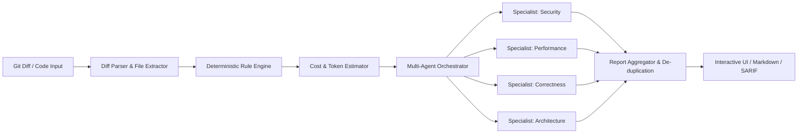

# AI Code Reviewer 🚀

> **Multi-Agent AI Code Review Platform** with deterministic rule scanning, specialist AI reviewers, cost/tier orchestration, and an extensible plugin & skill engine.

---

## 📖 Overview

**AI Code Reviewer** (`ai-review-platform`) is a modular, event-driven, provider-agnostic code review suite designed to deliver automated, high-precision code reviews. By combining **fast deterministic static analysis** with **specialized multi-agent LLM reasoning**, the platform pinpoints security vulnerabilities, performance regressions, logical bugs, architectural antipatterns, and style violations across Git diffs and codebases.

---

## ✨ Key Features

- 🤖 **Multi-Agent Specialist Reviewers**: Dedicated AI personas evaluating code across distinct domains (Security, Performance, Correctness, Architecture, Style, and Test Coverage).
- ⚡ **Hybrid Inspection Pipeline**: Runs high-speed deterministic regex/AST linters first to catch obvious issues, feeding structured context to LLMs for deep analytical reviews.
- 💰 **Tier & Cost Orchestrator**: Accurately estimates token usage and cost before executing reviews, with configurable tiers (`Fast / Balanced / Deep`).
- 🧠 **Context & Skills Engine**: Plug-and-play skills and context providers that enhance reviewer capabilities with repo-level intelligence.
- 📊 **Multi-Format Reporting**: Generates reviews in interactive UI, Markdown, JSON, HTML, and SARIF formats.
- 🖥️ **Full-Stack & Desktop Ready**: Built as a responsive React web application with live SSE streaming, paired with an Express backend and packaged with Electron for desktop use.
- 🧩 **Monorepo Architecture**: Clean package boundaries orchestrated with Turborepo and TypeScript workspaces.

---

## 🏗️ Architecture & Monorepo Structure

```
├── apps/
│   ├── web/               # React + Tailwind + Vite front-end client
│   └── api/               # Standalone API server definitions
├── packages/
│   ├── agent-runtime/     # Execution runtime and tool dispatcher for AI agents
│   ├── config/            # Centralized configuration and schema loaders
│   ├── context-engine/    # Git diff & codebase context aggregation
│   ├── core/              # Core domain types, entities, and interfaces
│   ├── git/               # Git utilities, diff parsers, and patch extractors
│   ├── llm/               # Provider-agnostic LLM interface (Gemini, OpenAI, etc.)
│   ├── memory/            # Review memory and historical tracking
│   ├── orchestrator/      # Multi-agent review pipeline coordinator and aggregator
│   ├── plugins/           # Pluggable rule analyzers and external linter bridges
│   ├── prompts/           # Specialized system and task prompts for review agents
│   ├── reporting/         # Output formatting (SARIF, Markdown, JSON, HTML)
│   ├── repository/        # Repository abstract storage and cache providers
│   ├── shared/            # Shared utilities, logging, and environment helpers
│   ├── skills/            # Extensible agent skills and execution handlers
│   ├── tools/             # AST, code search, and static analysis tools
│   ├── ui/                # Shared UI component primitives
│   └── workflow-engine/   # Graph-based review execution workflows
├── server.ts              # Full-stack API & development web server
├── main.cjs               # Electron desktop main process entry
└── turbo.json             # Turborepo task pipeline configuration
```

---

## 🚀 Getting Started

### Prerequisites

- **Node.js**: `v18.0.0` or higher
- **npm** / **bun** / **pnpm**

### 1. Installation

Clone the repository and install all dependencies:

```bash
git clone <repository-url>
cd ai-review-platform
npm install
```

### 2. Environment Configuration

Copy the example environment file and add your API keys:

```bash
cp .env.example .env
```

Edit `.env` to configure your LLM provider:

```env
# Gemini API Key (Default)
GEMINI_API_KEY="your-gemini-api-key-here"

# Optional overrides
AI_REVIEW_LLM_PROVIDER="gemini" # or "openai", "anthropic", "ollama"
AI_REVIEW_LLM_API_KEY="your-api-key"
```

### 3. Running in Development

Start the development server (runs full-stack Express + Vite at `http://localhost:3000`):

```bash
npm run dev
```

Open [http://localhost:3000](http://localhost:3000) in your browser to access the application.

---

## 🛠️ Available Scripts

| Command | Description |
| :--- | :--- |
| `npm run dev` | Starts the unified full-stack server in development mode (`tsx server.ts`) |
| `npm run build` | Builds all packages via Turborepo and compiles the production server bundle |
| `npm run start` | Launches the compiled production server (`node dist/server.cjs`) |
| `npm run clean` | Cleans build caches and generated artifacts |
| `npm run desktop` | Starts both the web backend and the Electron desktop application |
| `npm run build:desktop` | Packages the desktop application for macOS, Windows, or Linux |

---

## 🔍 Review Pipeline Overview



1. **Diff Ingestion**: Input patch or Git repository diff is parsed into structured files and hunks.
2. **Deterministic Scan**: Zero-cost pattern and security checks run instantly.
3. **Plan & Cost Estimation**: Assesses diff complexity, tokens, and budget.
4. **Agent Execution**: Runs domain specialist agents concurrently with contextual tools and skills.
5. **Deduplication & Scoring**: Merges findings, eliminates overlaps, assigns severity scores (`Critical`, `High`, `Medium`, `Low`, `Info`).
6. **Delivery**: Renders visual findings with suggested code fixes, exportable to multiple formats.

---

## 🔌 Supported Review Dimensions

- 🔒 **Security**: SQL Injection, XSS, Hardcoded secrets/credentials, CSRF, insecure dependencies, privilege escalation.
- ⚡ **Performance**: N+1 queries, memory leaks, blocking event loops, unmemoized expensive computations, payload bloat.
- 🎯 **Correctness**: Off-by-one errors, unhandled promise rejections, race conditions, null-pointer dereferences, edge-case bugs.
- 🏛️ **Architecture & Clean Code**: SOLID violations, tight coupling, code duplication, modularity, maintainability.
- 🧪 **Testing & Coverage**: Missing unit/integration tests, untestable patterns, edge cases lacking assertions.

---

## 📄 License

This project is private and maintained for automated AI code review workflows.
