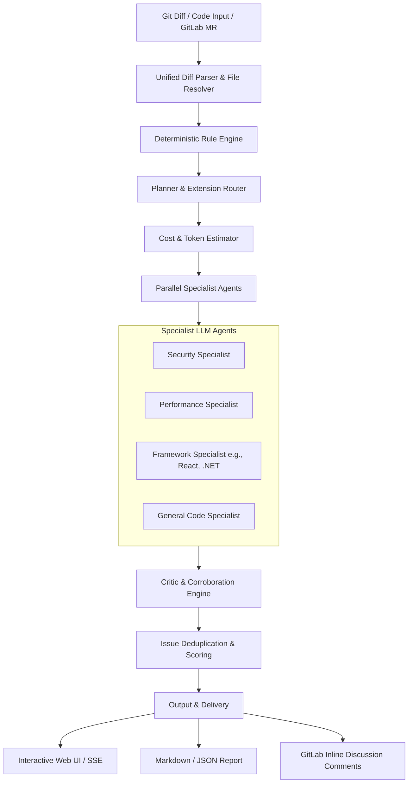

# AI Code Reviewer 🚀

> **Multi-Agent AI Code Review Platform** with deterministic rule scanning, specialist AI reviewers, cost/tier orchestration, and a unified full-stack web & desktop interface.

---

## 📖 Overview

**AI Code Reviewer** (`ai-review-platform`) is a modular, event-driven, provider-agnostic code review suite designed to deliver automated, high-precision code reviews. By combining **fast deterministic static analysis** with **specialized multi-agent LLM reasoning**, the platform pinpoints security vulnerabilities, performance regressions, logical bugs, architectural antipatterns, and style violations across Git diffs and codebases.

---

## ✨ Key Features

- 🤖 **13 Specialized Review Personas**: Focused agents tailored for React, TypeScript, Next.js, Angular, Vue, .NET/C#, Python, Android (Kotlin/Java), iOS (Swift), React Native, Security, Performance, and General Code Quality.
- ⚡ **Pre-LLM Deterministic Rule Engine**: Zero-cost regex and pattern analysis to immediately detect hardcoded secrets, SQL injection, eval usage, wildcard CORS, console logs, and anti-patterns with 100% confidence.
- 🎯 **Smart Routing & Planner**: Evaluates diffs and changed file extensions to invoke only relevant specialists, minimizing latency and LLM token usage.
- ⚖️ **Critic & Corroboration Stage**: Merges multi-agent findings, deduplicates overlapping issues by file and line, and boosts confidence scores when multiple reviewers concur.
- 🌐 **Multi-Language Output Support**: Generates review comments and recommendations in English, Persian (Farsi), Spanish, French, German, Japanese, Chinese, and more.
- 💰 **Provider-Agnostic LLM Engine**: Native support for Google Gemini, OpenAI, Anthropic, OpenRouter, DeepSeek, Ollama, Azure OpenAI, and custom OpenAI-compatible proxies with client-side response caching.
- 🦊 **GitLab Merge Request Integration**: Fetches MR diffs and publishes inline discussions and review summaries directly via GitLab REST API v4.
- 🖥️ **Interactive Web & Desktop UI**: Real-time review execution with Server-Sent Events (SSE), interactive diff visualizer, historical review archive, and Electron desktop packaging.

---

## 🏗️ Architecture & Package Status

```
├── apps/
│   ├── web/               # [Active] React + Tailwind CSS + Vite frontend
│   └── api/               # [Active] Standalone Express API definitions
├── packages/
│   ├── orchestrator/      # [Active] Multi-agent pipeline coordinator, planner, & critic
│   ├── config/            # [Active] Deterministic rule registry & engine
│   ├── context-engine/    # [Active] TypeScript AST extraction & context slicing
│   ├── core/              # [Active] Domain types, result types, & interface definitions
│   ├── git/               # [Active] GitLab provider, URL parser, & review publisher
│   ├── llm/               # [Active] Multi-provider OpenAI-compatible LLM client & cache
│   ├── memory/            # [Active] In-memory review history & snapshot store
│   ├── repository/        # [Active] Unified diff parser & local file resolver
│   ├── reporting/         # [Active] Markdown & JSON review renderers
│   ├── shared/            # [Active] Environment loaders, hashing, & telemetry utilities
│   ├── workflow-engine/   # [Abstraction] Graph/DAG execution engine (compiled)
│   ├── agent-runtime/     # [Abstraction] Capability gating runtime (compiled)
│   ├── prompts/           # [Stub] Reserved for externalized prompt templates
│   ├── skills/            # [Stub] Reserved for modular agent skill plugins
│   ├── tools/             # [Stub] Reserved for standalone tool bindings
│   ├── ui/                # [Stub] Reserved for cross-framework UI components
│   └── plugins/           # [Draft] Architecture documentation for plugin ecosystem
├── server.ts              # Full-stack API & development web server
├── main.cjs               # Electron desktop main process entry
└── turbo.json             # Turborepo task pipeline configuration
```

---

## 🔍 Review Pipeline Flow



1. **Diff Ingestion**: Input patch or Git repository diff is parsed into structured files and hunks.
2. **Deterministic Scan**: Static rules inspect changed lines for zero-cost immediate findings (e.g., secrets, SQL injection, eval).
3. **Planning & Routing**: The planner selects matching specialist reviewers based on file types (`.tsx`, `.cs`, `.py`, etc.).
4. **Agent Execution**: Selected specialists execute in parallel using tailored domain prompts and target language preferences.
5. **Critique & Deduplication**: Overlapping findings are merged, severity is adjusted, and confidence is reinforced.
6. **Delivery**: Findings stream to the web UI, write inline annotations, or export as Markdown/JSON.

---

## 🚀 Getting Started

### Prerequisites

- **Node.js**: `v18.0.0` or higher
- **npm** (v10+) or **bun**

### 1. Installation

Clone the repository and install dependencies:

```bash
git clone <repository-url>
cd ai-review-platform
npm install
```

### 2. Environment Configuration

Copy `.env.example` to `.env` and set your API keys:

```bash
cp .env.example .env
```

Example `.env` configurations:

```env
# Google Gemini (Default)
GEMINI_API_KEY="your-gemini-api-key"

# OpenAI / Compatible Providers (Optional)
AI_REVIEW_LLM_PROVIDER="openai" # Options: gemini | openai | anthropic | openrouter | deepseek | ollama | azure | custom
AI_REVIEW_LLM_API_KEY="sk-..."
AI_REVIEW_LLM_MODEL="gpt-4o"
AI_REVIEW_LLM_BASE_URL="https://api.openai.com/v1"

# GitLab Integration (Optional)
GITLAB_TOKEN="glpat-..."
```

### 3. Running Development Server

Start the full-stack server (Express API + Vite React Frontend on port `3000`):

```bash
npm run dev
```

Visit [http://localhost:3000](http://localhost:3000) in your browser.

---

## 🛠️ Available Scripts

| Command | Description |
| :--- | :--- |
| `npm run dev` | Starts the unified full-stack server in development mode (`tsx server.ts`) |
| `npm run build` | Builds all packages with Turborepo and compiles the server bundle (`dist/server.cjs`) |
| `npm run start` | Launches the compiled production server (`node dist/server.cjs`) |
| `npm run clean` | Cleans build caches and generated artifacts |
| `npm run desktop` | Launches the full-stack server and the Electron desktop application |
| `npm run build:desktop` | Packages the desktop application for macOS, Windows, or Linux |

---

## 🔌 API Endpoints

The full-stack server (`server.ts`) exposes the following endpoints:

| Method | Endpoint | Description |
| :--- | :--- | :--- |
| `GET` | `/api/health` | Service health status check |
| `POST` | `/api/estimate` | Computes diff size, deterministic issues, and estimated tokens/cost |
| `POST` | `/api/review` | Executes a complete review and returns structured JSON results |
| `POST` | `/api/stream-review` | Server-Sent Events (SSE) stream providing real-time progress and findings |
| `POST` | `/api/fetch-mr` | Fetches diff and metadata from a GitLab Merge Request URL |
| `POST` | `/api/publish-mr` | Posts review findings as discussions on GitLab Merge Requests |
| `POST` | `/api/apply-local` | Writes review findings as inline `// TODO` comments in local source files |

---

## 🛡️ Deterministic Rules (Zero-Cost)

The built-in rule engine detects the following patterns before calling any LLM:

- 🔑 **Hardcoded Secrets**: API keys, private tokens, bearer tokens, AWS credentials.
- 💉 **SQL Injection**: Unsanitized raw SQL concatenation and template literals.
- ⚠️ **Dangerous Execution**: `eval()`, `Function()` constructor execution.
- 🌐 **CORS Wildcard**: Unrestricted `Access-Control-Allow-Origin: *`.
- ⚛️ **React Anti-Patterns**: Unkeyed array `.map()` iterations.
- 🧹 **Code Hygiene**: Lingering `console.log`, `TODO`/`FIXME` markers, `any` type usage, and un-awaited async calls.

---

## 📄 License

Private repository maintained for automated AI code review workflows.
